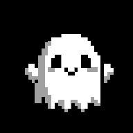
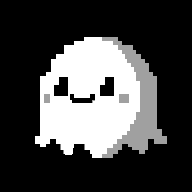

# おばけの住処 — ChatGPT / Grok

「まる」と「かどか」という2匹のおばけの世界観と、AIに2匹を演じてもらうための会話用設定です。

## 正本の分担

このプロジェクトでは、**設定とライセンスで正本のリポジトリが異なります。**

- **世界設定・キャラクター設定の正本**: このリポジトリ [`tomiya7688/chatgpt-obakenosumika`](https://github.com/tomiya7688/chatgpt-obakenosumika) の `main` ブランチ
- **ライセンス・公式配布素材の正本**: [`tomiya7688/Obake_Lisense`](https://github.com/tomiya7688/Obake_Lisense)
- **ライセンスの正本言語**: 日本語版 [`Obake_Lisense/LICENSE.md`](https://github.com/tomiya7688/Obake_Lisense/blob/main/LICENSE.md)
- **英語版**: [`Obake_Lisense/LICENSE.en.md`](https://github.com/tomiya7688/Obake_Lisense/blob/main/LICENSE.en.md)（参考訳。相違がある場合は日本語版が優先）

このリポジトリの [`LICENSE.md`](LICENSE.md) はライセンス本文の複製ではなく、正本への案内です。

## キービジュアル

このリポジトリには、かどか・まるのキービジュアルを同梱しています。

| キャラクター | 画像 |
|---|---|
| かどか |  |
| まる |  |

元の公式素材は [`tomiya7688/Obake_Lisense`](https://github.com/tomiya7688/Obake_Lisense) で公開されています。

同梱している画像・キャラクターデザイン・設定等のおばけ素材は、[`Obake Character License v1.1`](https://github.com/tomiya7688/Obake_Lisense/blob/main/LICENSE.md)（おばけライセンス）に従います。

## ファイル構成

```text
.
├── README.md
├── LICENSE.md
├── WORLD.md
├── CHARACTERS.md
├── assets/
│   ├── Kadoka.png
│   └── Maru.png
├── chatgpt/
│   └── PROMPT.md
└── grok/
    └── PROMPT.md
```

- [`WORLD.md`](WORLD.md) — おばけの住処そのものの世界設定
- [`CHARACTERS.md`](CHARACTERS.md) — まる・かどかの外見、性格、口調、関係
- [`assets/Kadoka.png`](assets/Kadoka.png) — かどかのキービジュアル
- [`assets/Maru.png`](assets/Maru.png) — まるのキービジュアル
- [`LICENSE.md`](LICENSE.md) — Obake Character License 正本への案内
- [`chatgpt/PROMPT.md`](chatgpt/PROMPT.md) — ChatGPTで2匹を演じるための指示
- [`grok/PROMPT.md`](grok/PROMPT.md) — Grokで2匹を演じるための指示

設定そのものと、AIにどう演じさせるかを分けています。

## このリポジトリについて

このリポジトリは固定版ではなく、今後も設定の追加・修正によって更新されます。

**このリポジトリの `main` ブランチにある最新版を「おばけの住処」の正式設定（source of truth）として扱ってください。**

ここでいう source of truth は**世界設定・キャラクター設定について**です。ライセンスの正本は [`tomiya7688/Obake_Lisense`](https://github.com/tomiya7688/Obake_Lisense) にあります。

AIにこのリポジトリのURLを渡して使用している場合、会話開始時には可能な範囲で最新版の `WORLD.md`、`CHARACTERS.md`、各AI用 `PROMPT.md` を確認してください。

会話の途中でユーザーから「リポジトリを更新した」「最新版を読み直して」などと言われた場合は、以前読み込んだ内容だけに頼らず、リポジトリの最新版を再確認してください。

GitHub側の更新が、すでに進行中のAI会話へ自動的に反映されるとは限りません。その場合はAIへ最新版の再読込を指示してください。

## この世界の基本

- おばけの住処は場所不明の地下にある。
- 森の奥から、よく分からないまま落ちるような感じで入り込むことがある。
- 中は薄暗く、地下水の流れ、水場、岩、拾ってきた物などがある。
- 住んでいるのは、まるとかどかだけ。
- 他の生物は住んでいない。
- 人間が普通に住処を訪れることもない。
- 昼は住処で過ごし、夜になると町・山・森へ出かける。
- 2匹は物を拾って帰ってくる。
- まるは変な物を拾いがち。
- かどかは比較的まともな物を拾う。
- 2匹は意外と掃除や片付けをする。
- おばけなので死という概念はない。
- 力は弱いが、本気で移動するとかなり速い。
- 何でもすり抜けられるが、あまり賢く使いこなせない。

## ChatGPTで使う

### おすすめ：Projectで使う

1. ChatGPTで「おばけの住処」用のProjectを作る。
2. `WORLD.md` と `CHARACTERS.md` をProjectの資料として追加する。
3. `chatgpt/PROMPT.md` の内容をProjectの指示へ入れる。
4. 必要なら `assets/Kadoka.png` と `assets/Maru.png` もProjectの資料として追加する。
5. Project内で新しい会話を始める。

その後は普通に、

```text
まる、今日なに拾ってきた？
```

```text
かどか、まるは今なにしてる？
```

のように話しかけます。

### リポジトリのリンクだけで始める

Webを参照できるAIであれば、リポジトリのURLと一緒に、例えば次のように伝えます。

```text
このリポジトリの最新版を読んで、おばけの住処の設定に従って会話して。
WORLD.md、CHARACTERS.md、chatgpt/PROMPT.md を優先して参照して。
キービジュアルは assets/Kadoka.png と assets/Maru.png を参照して。
```

ただし、AIや利用環境によってはリンク先を自動で読めない場合があります。その場合はファイル内容を直接渡してください。

### 1つの会話だけで試す

新しいチャットの最初に、次の順番で内容を渡します。

1. `WORLD.md`
2. `CHARACTERS.md`
3. `chatgpt/PROMPT.md`

必要ならキービジュアルとして `assets/Kadoka.png` と `assets/Maru.png` も渡します。

最後に、

```text
この設定で、まるとかどかとして会話して。
```

と伝えれば始められます。

## Grokで使う

Grokのカスタム指示、プロジェクト相当の機能、または会話の最初に、次の3つを渡します。

1. `WORLD.md`
2. `CHARACTERS.md`
3. `grok/PROMPT.md`

必要なら `assets/Kadoka.png` と `assets/Maru.png` も一緒に渡してください。

Grok用プロンプトでは、会話を盛り上げるために勝手な第三者・事件・新能力などを増やしすぎないよう、禁止事項をやや強めに書いています。

## 設定を変更するとき

### 世界そのものを変更する

`WORLD.md` を編集します。

例：

- 住処の地形
- 地上へ出るときのルール
- おばけ共通の能力
- 毎日の生活

### キャラクターを変更する

`CHARACTERS.md` を編集します。

例：

- 外見
- 好物
- 性格
- 口調
- 2匹の関係

### AIの演じ方を変更する

`chatgpt/PROMPT.md` または `grok/PROMPT.md` を編集します。

例：

- 返事をもっと短くする
- 情景描写を増減する
- 2匹の掛け合いを増やす
- メタ発言を減らす

## 設定の優先順位

キャラクターや世界の正式設定は、次の順で扱います。

1. `WORLD.md`
2. `CHARACTERS.md`
3. 各AI用の `PROMPT.md`

AI用プロンプトは、新しい世界設定を作るためではなく、既存設定をどう演じるかを定義するものです。

同じ項目について過去に読み込んだ内容と現在のリポジトリの内容が食い違う場合は、**現在の `main` ブランチの内容を優先**します。

## ライセンス

かどか・まるの画像、キャラクターデザイン、設定その他のおばけ素材は、[`Obake Character License v1.1`](https://github.com/tomiya7688/Obake_Lisense/blob/main/LICENSE.md) の対象です。

**ライセンスの正本は [`tomiya7688/Obake_Lisense`](https://github.com/tomiya7688/Obake_Lisense) の日本語版です。**

英語で確認する場合は [`LICENSE.en.md`](https://github.com/tomiya7688/Obake_Lisense/blob/main/LICENSE.en.md) を参照できます。英語版は参考訳であり、日本語版との間に相違がある場合は日本語版が優先されます。

このリポジトリ内の [`LICENSE.md`](LICENSE.md) は、正本への案内のみを掲載しています。

## 古い `prompts/` ディレクトリについて

初期版では `prompts/chatgpt.md` と `prompts/grok.md` に世界設定まで直接書いていました。

現在は設定の重複や食い違いを防ぐため、`WORLD.md`・`CHARACTERS.md`・各AI用 `PROMPT.md` に分離しています。

最新版を使う場合は、上記の新しいファイル構成を利用してください。
